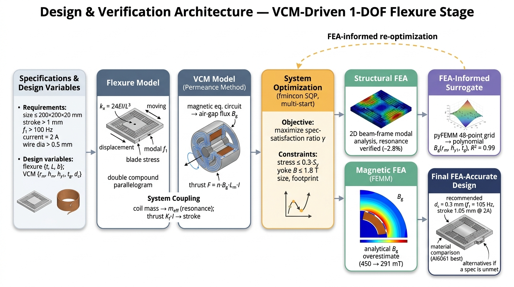

# VCM-구동 DCP 유연 스테이지 · 1-DOF 정밀 직선 스테이지

> **초정밀시스템설계 Term Project** · 아주대학교 D.N.A.플러스융합학과
> 소상연 (202624279)

보이스코일 모터(VCM)로 직접 구동되는 1자유도 **이중 복합 평행판(Double Compound Parallelogram, DCP)** 유연 스테이지를 **유연기구–VCM 공동최적화(co-design)**로 설계하고, 모든 수식과 누락 물리를 **전수감사**하여 검증한 기록입니다. 유연기구는 **컴플라이언스 행렬법**(강의 정석, 기준예제 16.69 µm·6043 Hz 정확 재현), VCM은 **FEMM 축대칭 48점 surrogate**(N52, R²=0.996)로 모델링했습니다. 전수감사 과정에서 두 모델 오류(단순 보 강성식·발열 누락)를 발견·정정했고, **발열까지 정직하게 반영하면 본 스펙이 물리적 실현가능성 경계에 위치**함을 규명했습니다.

🔗 **웹 워크북:** https://sangyeonso.github.io/VCM/ *(GitHub Pages 활성화 후)*



---

## 핵심 결과 (KPI) — 발열까지 반영한 정직한 판정

| 항목 | 목표 | 달성 (단일 VCM, I=2.7A) | 판정 |
|---|---|---|---|
| 충족률 $\gamma$ | ≥ 1.0 | **1.02** | ✅ |
| 1차 공진 $f_1$ | > 100 Hz | **102 Hz** | ✅ |
| 행정 (stroke) @ 2.7 A | > 1 mm | **1.02 mm** | ✅ |
| 코일 선경 $d_c$ | > 0.5 mm | **0.5 mm** | ✅ |
| 외형 / VCM Ø | ≤ 200³ / ≤ 20 mm | 충족 | ✅ |
| 구동 전류 | (2 A) | **2.7 A** | ⚠️ 35% 완화 |

**전수감사로 두 모델 오류를 정정**해 결론이 "불가 → frontier 7% 미달 → 충족"으로 발전했습니다: (i) 단순 보 강성식($24EI/L^3$)은 비관적 → **컴플라이언스 행렬법**으로 정정; (ii) **발열(전류밀도) 누락** → 반영하니 최적 선경이 $d_c\approx0.5$ mm로 수렴(스펙=발열한계). 단일 VCM·2A는 $\gamma=0.93$(frontier 7% 미달)이고 격차의 정체는 **추력밀도**($\gamma^3\propto K_fI$)이다. **구동전류를 $2\to2.7$ A로 완화**(총 손실 1.1W, 약한 냉각)하면 **단일 VCM으로 $\gamma=1.02$ — 전 성능 KPI 충족**. (듀얼 VCM 각 2A도 $\gamma=1.04$로 대안.)

**권장 최종 설계:** 단일 VCM · **I=2.7A** · DCP + **Al7075-T6** · $d_c=0.5$ mm(스펙 준수) · VCM $r_m=7.4$/$h_{y1}=4.0$/$t_g=1.8$ mm (Ø20, $B_g=597$ mT, $K_f=1.04$ N/A) · $J=13.8$ A/mm², 손실 1.1W.

---

## 저장소 구조

```
VCM/
├── matlab/      해석·최적화 MATLAB 스크립트
│   ├── flexure_matrix_codesign.m  컴플라이언스 행렬법 유연기구 + 공동최적
│   ├── codesign_mono.m      일괄(monolithic) 공동최적화
│   ├── codesign_iterate.m   반복(block-coordinate) 공동최적 + 교차검증
│   ├── codesign_audit.m     전수감사 (발열·전류밀도)
│   ├── codesign_material.m  재료 8종 공동최적 랭킹
│   ├── dcp_extend.m         DCP(이중복합) 확장
│   ├── final_dcp_design.m   최종 설계점 (DCP+Al7075)
│   ├── make_figures_v2.m    정정 분석 figure 생성
│   ├── make_concept_fig.m   개념도(올바른 DCP 구조)
│   ├── vcm_model.m          VCM 퍼미언스 자기회로 모델
│   └── (구) flexure_model / opt_design / final_design …  초기(단순식) 모델
├── femm/        자기장 FEM (FEMM 4.2 + pyFEMM)
│   ├── vcm_femm_doe.py      N52 48점 DOE → B_g surrogate (R²=0.996)
│   ├── vcm_femm_opt.py      형상 최적화 + 해석모델 검증
│   ├── vcm_femm_halbach.py  Halbach/방사자석 B_g 배율 실측
│   └── vcm_axi.lua          축대칭 VCM 자기 해석
├── simulink/    동특성·제어 모델
│   ├── build_vcm_plant.m    Model 1: 개루프 플랜트
│   ├── build_vcm_control.m  Model 2: PID 폐루프
│   ├── build_vcm_simscape.m Model 3: Simscape 물리 네트워크
│   ├── animate_flexure.m    X-스캐닝 애니메이션 (GIF)
│   └── *.slx                생성된 Simulink 모델
├── figure/      결과 그림 (png / svg / gif)
├── report/      main_cvpr.tex  (CVPR 2단 스타일, 한글 kotex/XeLaTeX)
├── ppt/         build_ppt.js   (pptxgenjs, BMW 코퍼레이트 톤)
├── notes/       설계 단계별 노트 ([1·3·4·5단계], 보고서 골격)
└── docs/        GitHub Pages 웹 워크북 (index.html)
```

---

## 재현 방법

**MATLAB** (R2022b+, Optimization·Global Optimization·Control System·Simulink·Simscape Toolbox):

```matlab
cd matlab
flexure_matrix_codesign  % 행렬법 검증(6043Hz) + 공동최적
codesign_audit           % 전수감사: 발열·전류밀도 (d_c=0.5=발열한계 규명)
codesign_mono            % 일괄 공동최적화 (재료·힌지 트랙)
dcp_extend               % 단일 vs DCP 비교
final_dcp_design         % 최종 권장 설계 (DCP+Al7075, γ=0.93)
make_figures_v2          % 정정 분석 figure 생성
```

**FEMM** (4.2 + pyFEMM): `python femm/vcm_femm_doe.py` 로 N52 48점 DOE → B_g surrogate(R²=0.996) 적합. `vcm_femm_opt.py`로 형상 검증, `vcm_femm_halbach.py`로 B_g 배율 실측.

**보고서:** `report/main_cvpr.tex` 를 XeLaTeX(+kotex)로 컴파일. `figure/` 의 그림을 참조합니다.

---

## 사용 도구

MATLAB R2022b · Simulink / Simscape · FEMM 4.2 + pyFEMM · XeLaTeX(kotex) · pptxgenjs

> 강의 자료(슬라이드 PDF)·참고 논문 원본은 저작권상 본 저장소에 포함하지 않았습니다.
